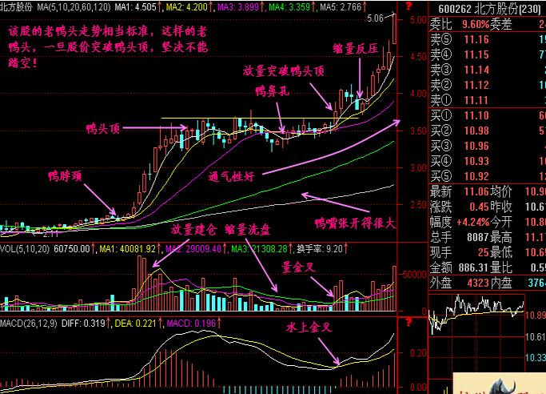
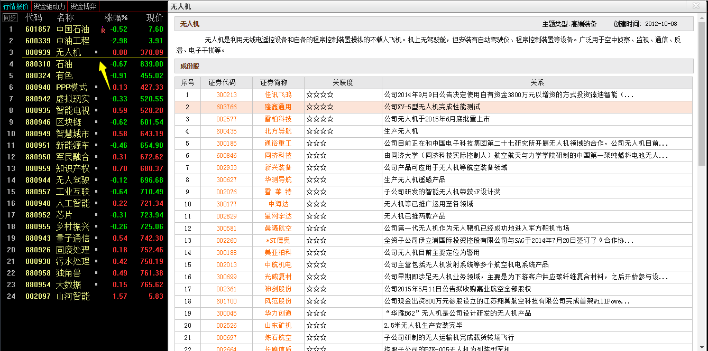
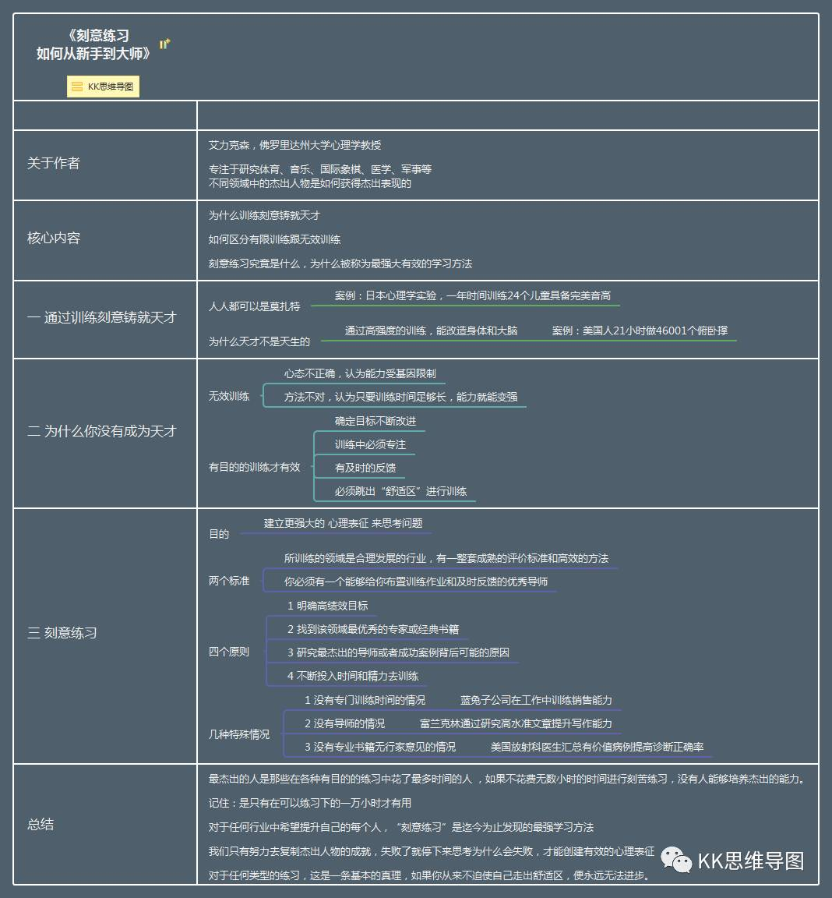
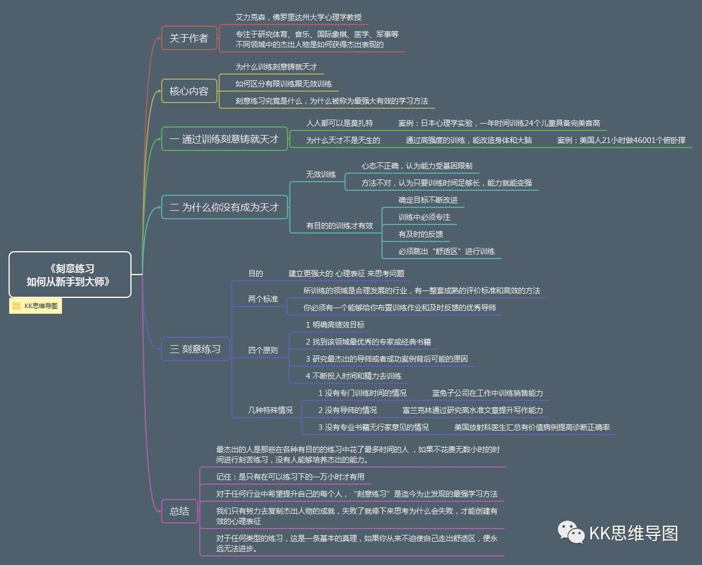
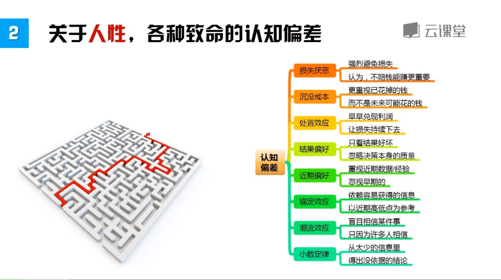

# books-2018

# [股票魔法师：纵横天下股市的奥秘（交易大师系列）](stock-magic.md)

1. 新的小盘股
2. 从趋势、基本面、催化剂分析，而不是市盈率
3. 关注领头羊
4. 牛市之前，大盘下跌，有些行业已经止跌回暖
5. 关注新科技，科技会变老
6. 每一个牛市都由一些领头羊带来的。之前牛市的领头羊很少（不到25%）能成为下次牛市的先锋。所以要准备好看到不熟悉的名字。
7. 老鸭头是标准靠谱的方式，注意回调深度、时间和成交量（天时地利人和）
8. 风险控制是职业和业余、伟大和平庸的决定因素。

**千金难买老鸭头**

- 天时：调整时间
- 地利：回调深度
- 人和：成交量

> 当我使用下跌幅度限制在10%的止损机制，我的投资结果大大改善。这种机制带来的整个投资组合业绩增长太过明显，令人难以置信。但在我重新检查了几遍之后，发现一切都是对的。采用该机制后，我的投资业绩从之前的二位数亏损变成了超过70%的盈利。

> 做一个严格的机会主义者，要非常挑剔地选择每一个入场点。在概率变得对你有利之前，耐心等待。有了耐心和自律，你才能从哪些缺少自律的对手面前拿走利润。在你什么都不做的时候，哪些缺少技巧的竞争者正在为你的成功铺平道路。

**新兴行业**：

# [算法之美](algorithms.md)

就看到一个信息：最佳停止时机 37%。在考察前37%的的申请人之前不要接受任何人的申请，然后，只要任何一个申请人比前面所有人都优秀，就要毫不犹豫地选择他。

# [自媒体写作：从基本功到实战方法](zimeiti.md)

# 刻意练习：从新手到大师

# 海龟法则-认知偏差

# [蔡康永说话之道](蔡康永说话之道.md)

# [兵器](兵器.md)

# [管理运筹学](管理运筹学.md)

# [刘墉-以诈止诈](刘墉-以诈止诈.md)

# [王阳明](王阳明.md)

# [一平米健身](一平米健身.md)

