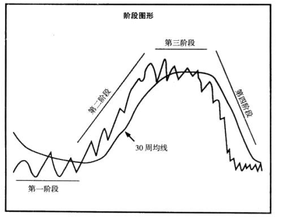

# 股票魔法师：纵横天下股市的奥秘（交易大师系列）

# 第一章 阅读提示

> 冠军不是在体育馆里练成的。冠军因他们心中的一些东西而成，一种欲望，一个梦想，一种眼光。 - 穆罕默德·阿里

一个不错的回报与超级回报相差甚远，远到你的生活会因此不同！

## 追随梦想，相信自己

> 不可能只是安于现状、习惯生活不敢改变的小人物的借口而已。

相信自己可以通过学习和练习达到超级回报！

## 交易会让你自由

股票市场拥有无限可能。

## 保守的多度乐观主义

尽管我很激进做交易，我的首要想法是“我可能损失多少”而不是“我能赚多少”。

风险第一！

作者在 1994-2000年回报率220%！

最大目标：保护我的交易账户以及之前在牛市中获取到的利润！

## 先投资自己

是什么支撑我走下去的？无条件的坚持！ 因为大部分人天生就有这样的偏好：高估自己短期的目标，并低估自己可以实现的长期目标。他们认为自己已经全力以赴了，但每当遇到困难的时候，就会泄气然后选择退出！

大部分只是感兴趣，感兴趣和致力于其中的区别，就在于是否愿意放弃。当你全身心投入到一件事情的时候，除了坚持到成功，别无选择。感兴趣只是起点，全身心奉献才是最终目的。

人能做的第一项，也是最重要的一项投资，就是投资自己 - 一个开始的承诺和坚持的信念！

## 机会永远垂青于有准备的人

我经常看股票图表和公司财报，每周专研70-80个小时！

准备好，当机会敲门的时候（他一定会来的），你能及时开门迎接！

## 获得永久的知识

经验无法直接喂给你，你只能自己操作才能获得。技巧一旦获得，别人无法抢走。

## 让激情燃烧起来

最好的交易员每天起床后，都对交易和投机感到兴奋！

激情无法学习，来自内心！

让兴趣主导你！

## 现在开始吧

> 你一开始不一定伟大，但你一定要开始变得伟大！

每天，我们都有机会选择未来的道路；每天都是余生的开始！

做一件不完美的事，远好于一个完美的计划！

## 分享的时刻

> 如果你不能向每一个人长期证明你都做了些什么，那么你所作的就是毫无价值的事情

投资股市是世界上最好的致富手段。

为了从投资的股票中获利，你必须做出三个正确的决定：买什么，什么时候买，什么时候卖。

# 第二章 你需要事先知道的

> 世界上每一个能都能超越自己的预期

绝大部分失败的原因是因为他们没有花费足够的时间学习和理解股市中的真正原理和带来超常业绩的原因。大部分投资者都在根据个人理解行动，而不是基于事实做判断。

很多人无法实现自己在股市中目标，深层次原因是很少有人真的相信自己能获得超级回报的股票。他们坚信，高额回报一定伴随着高风险。

高回报不一定需要高风险！

## 运气？不需要

> 实践得越多，我就越幸运！

股市中的成功和运气无关。相反，你在一个有效的计划上做的准备越多，就会变得越幸运。

## 少量资金就可以开始

我身边有很多从很少资金开始并最终变得富有的人，我们有一个共同点，就是会拒绝那些想要说服我们放弃的人。记住，那些说你做不到的人，他们自己一定永远做不到。

## 不！这次没有什么不同

> 华尔街不会改变，改变的只是裤兜和股票。

> 太阳底下没有新东西

每次牛熊市，都是一样的！没有什么“这次和以前不一样”。每一次，人们都会因为贪婪、恐惧、忽视和希望，用同样的方式对市场行为作出反应。

我可以负责任告诉你，一切都没有怎么改变，事实上，历史在一遍又一遍地重演。

## 最大的敌人不是市场

最大的挑战不是市场，而是你自己！

## 没人会为你着想

要最自己有信心。学者自己研究独立思考。

## 目的是要证明自己还是要赚钱

专心赚钱，忘掉自负的一面。我开始快速卖掉亏损的股票，不怕承认自己的错误。

交易不是找到高点、低点或者证明你有多聪明，交易是为了赚钱。

## 熟不一定能生巧

> 练习不一定能成就完美，只有完美的练习才能。

错误可能盈利，但最终会失败！提防：错误的盈利。

## 为什么不我喜欢仿真交易

## 交易是一种创业

事实上，为了成功，你必须像经营公司一样经营自己的股票。作为一个投资者，你的商品就是股票。

总之，最终你的目的都是平均收益高于平均损失，找到利润点，然后重复之前的过程。这就是工作的本质。

交易不是兴趣，而是职业

## 不要像基金经理一样投资

获得超常回报的一个关键因素就是：找到那些数量较少但价格浮动较大的股票。基金经理只能做大股票、蓝筹。

## 传统的智慧只能带来传统的结果

需要去做那些大部分人都不会去做的事情。

## 成功路上不可避免的成本

问问你自己，目标是什么？为了达到这个目标，你要放弃什么？

## 为目标全力以赴

必须专注，不要想着震荡和单边都能通吃！！自己不是天才。

## 交易员还会投资者

大部分交易员花费大部分时间在2种情绪中变来变去：犹豫和后悔。这根源于没有清晰的投资风格。

战胜这种不利情绪的最好方法就是制定一系列的规则！做短线的，卖了翻倍也不应该懊悔，做长线的，就应该做好放弃短期收益。

## 准备好面对极坏的日子

> 很多人的失败是当他们放弃的时候，没有意识到自己距离成功有多近。

不要因为那些最坏的日子而放弃。

## 记录天生就是用来打破的

很多年前，大家公认人类无法在4分钟跑完一英里（1069米）。

# 第三章 入门分析法：SEPA策略

> 一个知道自己策略优缺点的交易员可以比那些不知道的业绩高出很多。

我很久对策略的理解仅仅是买那些被低估的股票，实际上并不成功。很多股票已经到了一年新高，然后价格继续飙升。

## 转折的开始

SEPA：入场点分析

专注于那些带来最大资本增值的股票，并研究这些股票的特征。

股票研究方向：研究最好的，从而发现最好的。

## 融会贯通

很多对我来说很有用很重要的法则看起来和利佛摩尔几十年前总结出来的没有什么区别

## 最后，是科技

使用电脑

## 发现与工作结合

根据自己的工作熟悉的领域，找到对应的股票。

## 领导者档案

记录超强股票的特征

## SEPA：一个精确的策略

SEPA目标在于利用所有现在的信息，以及在考虑风险与回报后找到最佳进场交易的时机。包括了公司基本面分析和股票的技术分析。

## SEPA的五个要素

* 趋势
* 基本面
* 催化剂
    * 新技术
    * 新产品
    * 新政策
* 买入时机
* 卖出时机

分析过程：
1. 股票必须满足趋势形态
2. 根据收入、销量、利润增长、相对优势等筛选。这里会剔除掉95%
3. 剩下股票和“领导者档案”仔细对比
4. 最后一步人为分类，根据特征排序，特征如下：
    1. 报告的收入和销量
    2. 收入和销量激增历史
    3. EPS（每股净利润）变化
    4. 收入增长和速度变化
    5. 公司指导手册
    6. 分析师净利润预测修正
    7. 利润率
    8. 行业和市场地位
    9. 潜在催化剂（新产品、新服务和公司新发展）、
    10. 同行业公司对比（对标分析）、
    11. 价格和交易量分析
    12. 流动性风险

SEPA排序过程中专注于识别如下内容：
1. 未来利润和收入激增和积极的估值修正
2. 机构对交易量的影响
3. 供求失衡引起的价格增长

## 收敛的概率

每次股票升高前都有很多确定的、可测量的标准。新特性（如新产品引入、创新）可以让公司更加快赚钱，这种情况会持续很长一段时间。结果，因为吸引了更多机构，这些公司股票会经历明显的价格战增长。

把基本面、技术面、数量分析和市场主调结合一起分析。

## 超常业绩的特征

大部分明星股票都有共同的、可见的特点。超过90%的明星股票是以市场的自我纠正或者走出熊市为起点。

### 明星股票很年轻

专注于那些表现良好、在市场走出低迷后能率先增长的股票。这些股票有共同点，比如高利润增长率和市场中强烈的产品需求。

很多投资者不喜欢那些自己没有听说过的公司，如果你的目标是成为股市的大赢家，这恰恰是不应该的。

### 规模很重要

小盘股。

关注处在成长期（净利润和收入加速增长）的中小企业。

## 专注于一种方式

---
# 第四章 价值和价格一致

看上去便宜的东西可能实际上很贵，而看上去贵的东西很可能就是下一个明星股票。

## PE 错用滥用

很多错误是从PE值（市盈率）来的。PE只考虑了历史结果，没有考虑将来。

## 抄底人的狂喜

PE可以一低再低。

## 便宜货的陷阱

不能仅仅因为便宜买入低价股。

## 不要错过高PE股

成长股在市场中溢价很正常。可以比市场平均值高出3-4倍。

高PE值的公司应该被当做潜在的被购买者而研究，特别是当你发现公司有一些新的、有意思的东西，同时催化剂已经准备就绪的时候。

互联网就是一个例子

大部分好的成长股不会有低的PE，大部分明星股都有30-40倍的PE。

实际上伟大的公司看起来永远很贵，而这正是很多投资者无法伟大的原因。

## 高增长吓跑了分析师

股票涨的时候，很多人把注意力放在错误的驱动价格上涨的原因，才是你错过这些伟大的股票的原因。

如互联网领导者雅虎，作者在938倍PE的时候买入，最终市盈率到了1700。价格涨了78倍。

## 什么是高，什么是低

## 法拉利比现代车贵是有原因的

好股票不会便宜。不会低PE。

## 只有人让股价波动

## 寻找价值投资机会

梵高的画和他内在价值无关。

价值投资没法保护你。

## 没有万能数字

各种各样的PE值都可能成为明星股票。

## 警惕市盈率超低的股票

市盈率只有2倍的，最终可能跌没了。

我愿意拥有哪些净利润前景好、PE值较高，而不是哪些PE很低、但发展有问题的公司的股票。

## 市盈率的骗局

在超卖的环境中买入和在超买的环境中卖出的交易策略风险很大。

## 破碎的领袖综合征

哪些拒绝在股票升空前买入新行业领袖股票的投资者，会在股票价格触底并开始下降时关注这只股票。这是股票的第4个周期（衰退期）。

就是涨疯了后的回调，大部分人喜欢这里买入。

多低的价格，都可能让你大亏。

## PE值是市场情绪的检测器

很多公司，成长前PE值会飞速上升。

高PE意味着较高的预期，反之亦然。

专注于那些有新事物不断出现的企业（有催化剂的企业）。与公司未来的利润增长潜力相比，目前的市盈率只是我不知道你的因素。成长股的关键是：成长性。

---
# 第五章 借助趋势交易

> 我不创造趋势。我只是发现他，然后借助他。

趋势是无商量的绝对标准。无论公司基本面多么好，不符合趋势指标都不买入。

## 与趋势交朋友

牛顿第一定律说运动的物体将一直运动下去。惯性。

股票亘古不变的有**四个阶段**。应该在第一个阶段结束第二个阶段开始的时候买入。

## 股票从无名走下成熟：四阶段理论

1. 忽略时期：巩固
2. 突围时期：加速
3. 到顶时期：分配利润
4. 衰败时期：投降

## 第一阶段

1. 不起眼
2. 围绕年线上下波动
3. 几个月或者几年
4. 第4阶段下跌几个月之后
5. 交易量很小，尤其小于第四阶段

第一阶段不要抄底。目标不是价格最低的时候买入，而是“正确的时候”

## 第一阶段过渡到第二阶段

1. 无声无息的突破，不会有相关的新闻。
2. 成交量红肥绿瘦。
3. 比近一年最低点最少高出25-30%。
4. 半年线、年线多头排列

## 如何精确找到第二阶段

1. 长期均线多头排列
2. 年线最少一个月上涨
3. 股价最少脱离底部30%
4. 股价在一年最高价75%内（不能回调过深）
5. 60日线下买入

## 第四阶段

1. 年线下，年线拐头
2. 股价在一年最低
3. 台阶时下跌
4. 空头排列
5. 放量下跌

## 关注问题作出预警

只有在存在一批股票进入了第四阶段之后，大盘可能到底。

---

# 第六章 行业、类别和催化剂

> 当领头羊打喷嚏时，整个行业都会感冒。

1. 领头羊
2. 顶级竞争对手
3. 机构宠儿
4. 复苏的公司
5. 周期型股票
6. 过去的领头羊和落后者

大众不敢买领头羊，因为他涨幅大。

关注的是公司的优势是什么？商业模式是否可以复制？

## 昂贵，其实很便宜

不要被“高速成长的股票风险是巨大的”误导。

## 类别杀手

品牌和市场地位过于强大以至于其他公司无法和他竞争。

## 曲奇模式

连锁店。

## 投资“曲奇模式”类公司要考虑的事情

价格和顾客量。

不同地区是否饱和，店面开够了之后只能较少，股价会下跌。

## 顶级竞争对手

饮料：可口可乐，百事。
咖啡：星巴克

上涨势头明显，并不断蚕食之前领头羊的股票地位。

在一个行业里面，永远要跟踪在最顶端的2-3家公司。

电脑出来了，录像厅就挂了，这就是竞争。

## 机构投资者的最爱

蓝筹股是成熟的公司，增长会比较慢

## 复苏的公司

麻烦缠身的公司复苏的时候也能带来巨大的利润。

如苹果，发布了ipod，iTunes， iPhone之后飙升。

## 周期型股票

对于经济或者大宗商品市场价格十分敏感的公司。

周期的底部特征：

- 净利润下降
- 分红较少，无
- 市盈率很高
- 新闻悲观

周期顶部特征：

- 净利润上升
- 分红增加
- 市盈率在低点
- 新闻乐观

## 离落后者远一点

便宜没好货

## 特定的引领牛市的行业

熊市底部需要特定的市场部分的积累。一般3-4个最多8-10个行业会引导新牛市的开始。

大盘在下跌，但部分板块已经止跌回暖。

大牛市来之前购买哪些领头羊的股票，可以让你获得很大的资本增值

通常牛市风向标中最好的股票在该行业炙手可热之前就已经大幅上涨。

## 新发明创造新机会

关注新兴行业。

新科技会变化老科技。如收音机，电视机，磁盘，PC

---

# 第七章 基本面关注点

基本面恶化，你永远不知道股价能下跌多少。

## 是什么导致股票的超常收益

股票不在乎过去，关注的是未来！

背后强大的力量：增长的利润和销售量。

## 为什么总是提净利润

多少？多久？多确定？

## 预测和意外

## 净利润惊喜

超预期

## 蟑螂效应

> 如果你看到家里有一只蟑螂，就该认为家里已经有很多蟑螂了。

> 见微知著

如果一个公司利润可观，接下来几个季度可能也会有惊喜。如果一个公司有惊喜，同一个行业的公司可能也有。

## 寻找有收入支撑的净利润

## 怎么样找到复苏的契机

利润是否有明确增长（最近季度涨幅100%），利润率新高来确定公司度过了困难期。

## 减少就是红灯

---
# 第八章 评估净利润质量

利润的来源

如果是单个产品推出或者某个大客户，这种增长很薄弱。利润增长是不是整个行业的共同现象？

## 非经营性或非经常性收入

如买房。利润应该来源于核心业务！而不是一次性收入。

## 警惕被处理过的数字

预期管理

公司先发出警告，分析师就会调低，结果出来会被分析师的好，但改变不了差的本质。

## 一次性冲刺销售

为了年报一次冲量。如果反复出现，需要警惕。

## 当心削减成本带来的利润增长

利润率：高销量，高价格，低成本

## 报告公布时刻

真正的利润增长股价应该不会回落

---

# 第九章 追随领头羊

每一个牛市都由一些领头羊带来的。之前牛市的领头羊很少（不到25%）能成为下次牛市的先锋。所以要准备好看到不熟悉的名字。

大盘指数上涨之前，很多好的股票早在几周前就开始加入上升信道了。怎么样上升初期抓住：追随领头羊。

牛市结束前，领头羊会率先止步

## 跟上节拍

不要怕高。

## 闭锁期

领头羊上涨，很多交易者在等待回调，但是并不会发生。挨着均线上，红肥绿瘦就可以介入，不要期待有大幅的回调。

## 明星股票触发因子

- 盈利惊喜
- 行业监管变化
- 政策变化
- 新合约
- 独一无二的产品推

## 股市底部信号

- 第一波市场领头羊出现，阶梯状抬高底部
- 振作起来的股票越来越多，领头羊休息
- 大部分领头羊可以守住阵脚，不会回调过深（15%以内）
- 大盘成交量应该红肥绿瘦

## 寻找主题

市场下跌的时候出现积极价格走势的的股票不断增大，下一批领头羊就要出现，只等市场回暖。当你看到这些价格变化的时候，是时候走出媒体和流言误导，研究市场的价格、交易量、利润、利润率、新产品、新趋势了。

## 该先买那只领头羊

最先买最强的。率先突围的。

当市场触底时，最好的公司股票价格一定被低估最多。

记得关掉收音机。

---

# 第十章 价值百万的图表

> 尽管猎豹是世界上速度最快的动物，并能在草原上抓住任何动物，但他在完全确定能抓住猎物之前会一直潜伏等待，他可能在树丛中藏身7天，等待正确的时机。他在等待一直幼小的羚羊，或者生病或者坡脚的羚羊，只有在那样，他在不可能错失猎物时，才会发起进攻。
> 对我来说，那就是职业交易的缩影。

关注大趋势长期均线，找到稳固期（第2阶段，回调期）。

坚持买第二阶段上涨期的股票，正确的买入时机是股价刚刚从稳固期走出来，价格开始上涨。或者新高以后。

## 收缩次数 - 缩量下调

回调次数应该在2-4次，每次的幅度应该越来越小。就是第一次回调250，然后是120，然后是60，然后是20，10，然后拐头往下。

回调是获利回吐，应该成交量缩小。

## 为什么在价格新高买入

被证明进入第二阶段

---

# 第十一章 不要只买你知道的股票

大部分明星股票在上市8-10年内就崭露头角。

## 第一根基

新股上市后观察一段时间，不能回调过深。

---

# 第十二章 风险管理：风险的本质

唯一保护你的投资组合，让其远离巨额亏损的方法就是在损失的雪球滚大之前卖掉他。

比赛中，市场开始回调，但是，这正是我希望的场景，我知道在这种时期，我严苛的交易规则不光不会让我遭受亏损，反而还能让我继续赚钱。我相信没有几个人能做到这一点。

我获得冠军的二个重要元素分别是“坚持”和“风险管理”。

## 冠军们的相同点是什么？

是否持续盈利是区分专家和业余选手的关键

## 只要你学会保护钱，钱将永远属于你

> 无论你面对的是上百万美元还是区区几千美金，你都应该使用相同的准则。这是你的钱，只要你保护他，他将永远属于你。错误的投机几乎是失去他们的最好方法。

> -- 杰西·利佛摩尔

要想实现持续的盈利，你就必须保护你的本级和收益。人们常犯的错误就是认为投资的回报并不属于自己，并不像珍惜原始资本一样对待投资回报。

有了盈利，仅仅表示我的账户有了新的起点。一旦我赚取了收益，这些钱就已经属于我，昨天的利润成了今天的本金。

通过持续并保守的下注，一个玩家可能在转盘上赢取1500美金，但之后，他开始不顾危险地下更大的赌注。在他眼里，现在下注使用的并不是自己的钱。这中事情也会发生在股市里面。业务的投资者会把赚取的回报当做市场的钱，而不是自己的钱。早晚，市场会把这些资金拿回去。

不能因为获利了就允许大的亏损。

## 合理的法则让你的视线更透彻

## 两次上涨一次下跌

3年分别是50%、50%和-50%，实际上总回报率只有12.5%。每年回报率只有4%。

## 说服自己：损失调整训练

> 伟大的投资者是指那些从一开始就懂得下跌的人。

当我使用下跌幅度限制在10%的止损机制，我的投资结果大大改善。这种机制带来的整个投资组合业绩增长太过明显，令人难以置信。但在我重新检查了几遍之后，发现一切都是对的。采用该机制后，我的投资业绩从之前的二位数亏损变成了超过70%的盈利。

我明白了，风险管理是通向成功道路的关键。我严格遵守这止损机制，结果是我的投资业绩上了一个新的台阶。我管这叫做“损失调整训练”。

## 接受市场的判断

> 只要你不握紧，没有事情能将你拽到。

## 知道自己何时是错误的

曾有人问我“你怎么知道什么时候自己是错的？”。我的回答永远是“当股价下跌的时候”。就是这么简单！

买入的股票一段时间没有如自己预期的那样上涨，我通常会卖掉他。

## 避免巨大错误发生

> 处置效应

事实上，你完全可以在选股正确率只有50%的情况下赢取巨额利润，但是要做到这一点，你必须控制自己的亏损！

总之，不要成为无意识的投资者。不要任由亏损下去！

## 多好的事情！

做一个严格的机会主义者，要非常挑剔地选择每一个入场点。在概率变得对你有利之前，耐心等待。有了耐心和自律，你才能从哪些缺少自律的对手面前拿走利润。在你什么都不做的时候，哪些缺少技巧的竞争者正在为你的成功铺平道路。

## 当错误成真时

> 成功的投资者和不成功的投资者的区别在于他们如何应对失败的股票。犯错误不是问题，问题是不肯接受错误。问题是一直犯错误！

股市里面，不管多聪明，都会犯错误，而且是非常多的错误。

## 如果你没有感觉愚蠢，你就没有在掌握风险

有时候我们卖掉股票接受损失后，股票会扭头重新上涨，这种时期在我身上发生了上千次，我会觉得愚蠢或者因此而愤怒吗？不！投资和交易股票都是与概率共舞，你只需要平均收益高于平均损失即可。想要每次都是正确的是不现实的。

## 为什么大多数投资者没能成功止损

我们花了很多时间在研究股票，买入后亏损会十分不甘心。

要想在股市中有可持续的成功，你必须觉悟到赚钱比证明自己正确更重要。你的自负必须放在一边。

如何控制亏损是区分平庸和伟大的决定因素。

---

# 第十三章 风险管理：如何处理并掌握风险

熊市里面依然可能获利，答案并非什么秘密，答案就是风险控制。

风险是可能损失的概率。

## 养成习惯

平庸和伟大的区别在于是否能自律。

刷牙成为了你的习惯，你并不需要对自己每天起床后说我要刷牙。

## 应急计划

### 初期止损

买入股票前，我会提前设定止损线：让我彻底退出该股的价格水平。

### 重新进入

止损后应该重新找入场点，只要技术面没有走坏。

### 获利并卖出

- 移动止损
- 走弱时卖出
- 快速上涨由于大量获利盘，可以考虑快速减低自己仓位

### 灾难计划

## 避开交易者的原罪

允许损失超过平均收益的行为我们称之为“交易者原罪”。

不管涨了多少，都是10%止损线。

## 事先决定好你的风险

只有在你创建仓位之前才能最清醒地思考退出时机。买入后，你已经没有时间考虑了，这时候你无须你做决定，你只需要执行之前的决定。

买入股票之前，把卖出价格写出来贴在电脑盘边。

## 像你的止损线致敬

让失败的股票脱离你的控制是最常见也最致命的错误。不适用止损交易就像开着一辆没有刹车的汽车，出事是早晚的事。

自从我决定使用止损线，发誓不让损失超出我的控制后，我的投资结果马上从平庸走向了出色！

你应该像医生抢救病人一样对待你的股票。医生要做的第一件事就是快速将血止住，因为病人流血越多，其恢复的可能性就越低。

## 一定会带来灾难的习惯

用赚来的钱来填补亏损的投资是让你走向贫穷的最快方法。

## 逐步建仓与摊低成本

专业投资者逐步建仓，业余投资者一次性买入越跌越买摊低成本。

## 分散投资并不能保护你

4个就足够了。

## 我的光着脚在雪中的故事

真正聪明的人是可以从别人的错误中获得经验。

