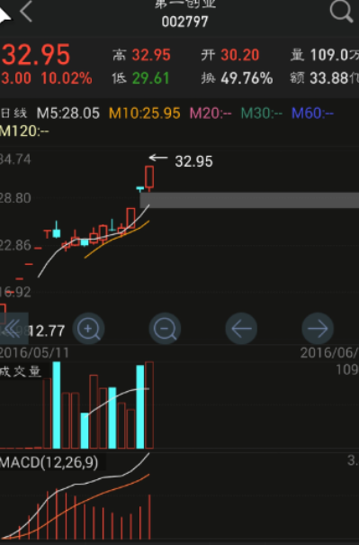
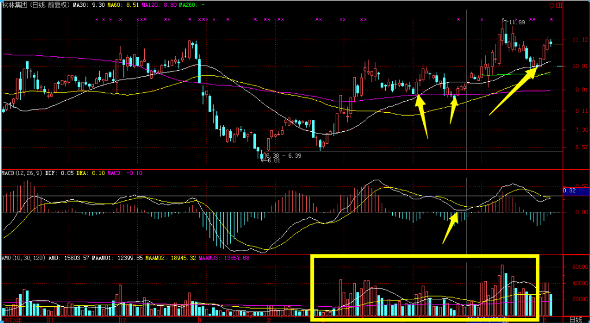
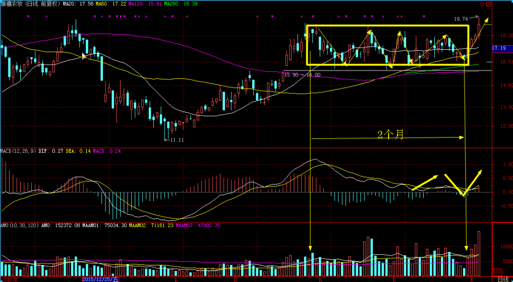

# 出手点

## 1. 新股第一次跌到10日线或者第一次下破0轴

## 2. 成交量特别漂亮的

> 买点在30日线左右和macd下穿0轴左右

## 3. 横盘整理到60日线的/macd下穿0轴

- 60日线会有2次回踩，如M
    - 0轴附近可能一次或者2次金叉
- 箱体下下沿就可以做T
    - 一般有3次以上回踩箱体
    - 箱体低点大概在第一回踩30日线的价格
- 60日线会等30日线上来
- 时间一般要2个月左右

**2016.6.4 002477**:

## 4. 妖股持续放量的

- 没有缩量就持有
- 没有剧烈震荡就持有

## 5. 一口气跌到30日线左右的

- 容易形成横盘等60日线的走势
- 这个价格就是后面的箱体下沿
- MACD应该已经死叉

## 6. 强度排序，macd 0轴下股价双底

## 7. 杠杠基金的趋势买点

