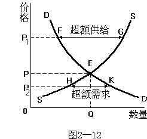

# 图解力经济学

## 1 毕业的两难选择

- 机会成本（为了得到某种东西所要放弃另一些东西的最大价值）
    - 1.资源是稀缺的
        - 稀缺性资源被配置到某种用途上，自然要放弃被配置到其他用途上的可能性
    - 2.资源具有多种用途
        - 资源用途单一，不存在选择的可能性，不存在放弃另一种选择的可能性
    - 3.资源得到充分利用
    - 4.资源可以自由流动
        - 可根据想法不同而变更
- 经济利润（总收益－【显性成本+隐性成本】）
    - 显性成本
        - 以货币形式支出的成本（账面上一眼看到的钱）
    - 隐性成本
        - 不以货币形式支出的成本
- 例子
    - 在大城市工作和在家乡做西红柿
    - 早餐是出去吃还是家里自己做

## 2 饭桌上的菜

- 需求曲线（价格越高，需求越小）
    - 替代品（功能相近）
        - 西红柿和黄瓜
    - 互补品
        - 黄瓜买多了就会相应购买白糖和醋
- 弹性
    - 0弹性需求（如药品）
        - 价格如何变化，需求量一致
    - 完全有弹性需求
        - 价格定值，需求量有无限可能
    - 缺乏弹性需求
        - 价格大幅变动，需求量变化不大
    - 单位弹性需求
        - 价格轻微变动，需求量轻微变动
    - 富有弹性需求
        - 价格轻微变动，需求量大幅变动
- 例子
    - 价格变化导致餐桌上菜的变化，价格越贵买的越少，而且有其他代替品

# 3 西红柿的产量

- 供给曲线 - 供给会根据成本和利润动态变化，成本低利润高供给就大
- 供需平衡 - 售价和需求数量的趋势线的交叉点，否则导致过剩或者短缺
    - 均衡点会动态变化

# 4 为何要讨价还价（买飞机模型）

- 支付意愿 - 如一个东西我最多可以出100块
- 消费者剩余 - 最多承受100，但80块就买到了，20块就是消费者剩余
- 边际效用递减
    - 第一口蛋糕感觉最好心理满足最多，后面越来越少

# 5 要不要投广告

- 囚徒困境
    - 欢乐园和开心乐园投放广告形成囚徒困境
- 完全信息动态博弈
    - 让对方先动，然后根据对方策略调整自己策略为之动态
- 不完全信息静态博弈
- 不完全信息动态博弈

# 6 电影票的优惠政策

- 价格歧视
    - 不同的人价格不一样，结果一样
        - 公交车老人免费
        - 不同地区价格不一样
    - 目的：商家获取了所有不同层次消费者的消费者剩余，利润最大化
    - 好处
        - 利润最大化
        - 满足更多消费者，更多消费者满意

# 7 Linda的工资

- 补偿性工资差别
- 超级明星现象

# 8 送错的礼物

- 信息不对称
    - 例子：追女孩投其所好
    - 例子：售房广告
- 发信号解决信息不对称
- 信息不对称之道德风险
    - 例子：大学生单纯失窃10%，创业成立公司，收保险费15%，最后还亏钱，原因有了保险后安全防范措施明显减少
- 逆向选择
    - 信息不对称无法判断好坏，导致不敢花大钱买好的东西，最后劣质淘汰优质

# 9 真假失业

- 经济学的事业和普通人说的失业不是一回事
- 失业原因
    - 摩擦性失业
        - 得带和想要不一致导致
    - 结构性失业
        - 如电子售票原来售票员失业
    - 周期性失业
        - 经济不景气等

# 10 钱是不是越多越好

- 通货膨胀