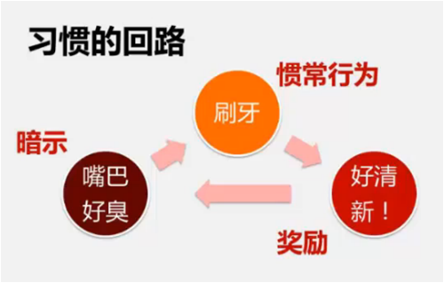
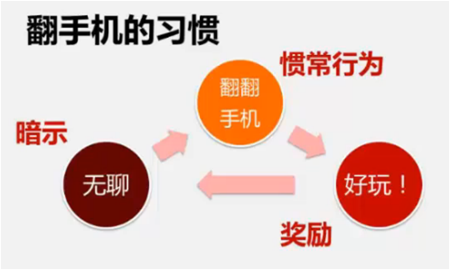
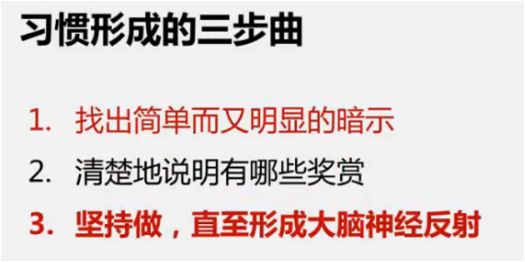
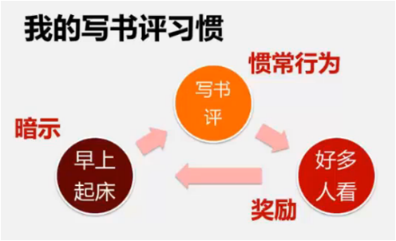

大部分是波波羊的分享。

## 习惯的力量

## 如何掌控自己的时间和生活

> 时间是掌握在自己手中的，时间是规划和管理出来的。经常没有时间的人，肯定是不会管理时间。

- 不能掌控自己时间的原因
    - 没有意识
        - 我们正在能利用的时间不超过10年
        - 我们的日常时间经常被别打扰和占用
        - 掌握时间的关键在于规划和执行
    - 不懂方法
    - 不做
    - 不坚持做
- 掌握时间的方法
    - 制定目标
    - 分解行动
    - 安排计划
    - 行动
- 有的放矢，没有目标就想没有靶心放出去的箭
    - 目标不明的绝大部分的人关键问题
- 三种目标
    - 长期目标：3年以上
    - 中期目标：6个月-3年
    - 短期目标：6个月以内
- 定时量化监控
    - 制定3个主要的短期目标，定期监控和调整
    - 按重要级别ABC排序
    - 最重要的不要三个
- 制作每日任务清单
    - 做每日清单绝对不要超过5分钟，2分钟思考，3分钟写入
    - 选择性记，不要凡事都记
    - 只给真正的A级留出时间
    - 不要排满，最少留一个小时
- 更好处理重要事情
    - 分清轻重缓急
    - 每天优先处理
    - 安排在“黄金时间”
    - 安排在每天的固定时间
- 拉金式问答
    - 什么是拉金式问答？
        - 在需要临时作出决定的时候，向自己提问：“我现在最应该做什么？”
    - 提出拉金式问答的时机？
        - 任务中断、走神、效率不高、多个任务。
        - 事情很多
        - 无聊的时候
    - 如何提醒？（自己形成习惯） 
        - 利用纸条、海报、牌子等。
    - 如何作出决定？
        - 根据二八原则，注意什么时候不用追求完美
- 对于长任务的方法
    - 瑞士干奶酪法
    - 分多段处理
    - 分段执行（每5分钟）
    - 做完在开展下一段
- 对于拖拉和逃避
    - 问清楚自己：为什么要逃避
    - 设置逃避的后果
    - 切断逃避的来源
- 退而取其次
    - 变相拒绝 -> 合理折中
        - 事情的效果上折中
        - 事情的执行时间上折中

## 拖延心理学

- 查分成可行的小目标
- 指定具体的时间，并保护好时间
- 时间到了就要执行
- 要注意拖延的信号（太累，状态不会，没有心情）
- 可以少做，但不能不做（质变、量变）
- 拖延后不要自责，而是思考拖延后得到了甚么？感觉是什么

## 改善拖延 

- 设立小的目标
    - 不是：我绝不拖延
    - 而是：我今天要花一个小时来读那本我一直想读么有读的书
- 把大部门拆分为小目标
    - 不是：我今天一定要把这本书读完
    - 而是：我今天读1/3, 明天后天在读 1/3
- 确定具体时间
    - 不是：我明天有大把时间来读书
    - 而是：明天上午去公园玩，下午2-3点读书
- 到了时间就做
    - 不是：2点啦，突然有个更加重要的事情，晚上再读吧
    - 而是：2点啦，我先读书，在去完成那件“更加重要”的事情
- 关注拖延的信号
    - 不是：我有点累，先睡一觉起来再读。
    - 而是：我是不是想拖延了？我为什么想要拖延？
- 保护自己的时间
    - 不是：我出去一下，朋友叫我帮忙
    - 而是：对朋友说：“不好意思，我现在在看书，3点后我有空”
- 合理面对困难
    - 不是：这本书我读不懂，累死了
    - 而是：这样，我先读我感兴趣的部分，每读15分钟，我就起来晃晃
- 留意自己的接口
    - 不是：我今天完全不在状态，换个时间
    - 而是：我今天确实有点不在状态，那么我今天只读15分钟就好了。
- 不要谴责自己
    - 不是：我又在拖延，我恨自己！
    - 而是：我又在拖延，为啥呢？我的感觉是什么？我又从中学习到了什么？
