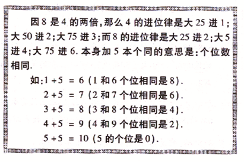

# 一目三行加法

提前虚进1，中间弃6，末尾弃10

不够9的分段

超过19的中间弃19，前面进1，末尾弃20，前面进1

# 乘以9

## 十位比个位大

24*9 = 216
37*9 = 333

百位不变，3个数加起来等于9

## 十位比个位大1

12*9 = 108
34*9 = 306

百位不变，中间是0，3个数加起来等于9

## 个位和十位一样

22*9 = 198

百位减1，中间是9，个位9-百位数

## 个位比十位大

53*9 = 4

百位减1，三个数加起来等于2*9=18

# 减法

## ab - ba 

53-35 = 18

> ab-ba=(a-b)*9

## abc - cba

> abc - cba = (a-c)*9 中间插入9

482 - 284 = 2*9 = 18 = 198

## 互补数

> 减去50/500，乘以2

73 - 27 = （73-50）* 2 = 46

# 乘法

> ab*cd=ac*100 + (ad+bc)*10 + db

## 十位相同，个位互补

> ab*a(10-b) = (a+1)*a*100 + b*(10-b) 

42*48=4*5*100 + 2*8 = 2016

## 十位互补，个数相同

> ab*(10-a)b = (a*(10-a)+b)*100 + b*b 

68*48=(6*4+8)*100 + 8*8 = 3264

53*53 = 2809

## 一个词是互补，另外一个二个数字相同

> （互补数十位+1）* 另外一个相同的数字 * 100 + 2个尾数相乘

64*88=（6+1）* 8 * 100 + 4*8 = 5632

## 十位数是1的

> 百位1 + 尾数相加*10 + 尾数相乘

18*16 = 100+（8+6）*10 + 6*8 = 288

## 个位是1的

> 十位相乘放百位，十位相加放十位，个位是1

81*41 = 8*4*100 +（8+4）*10 + 1 = 3321

## 任意二位数

ab*cd

> 个位：相乘（b*d）\
> 十位：交叉相乘然后相加（a*d + b*c）\
> 百位：相乘(a*c)

34 * 59 = 3*5*100 + （4*5+3*9）*10 + 4*9 =  2006

## 任意三位数乘以二位数

abc*de

> 个位：相乘（c*e）\
> 十位：个位和十位交叉相乘然后相加（b*e + c*d）\
> 百位：二位数和三位数前二位交叉相乘相加(a*e + b*d)\
> 千位：前面相乘 (a*d)

312*56 = 2*6 + (2*5+1*6)*10 + (1*5+6*3)*100 + 3*5*1000
       = 12 + 160 + 2300 + 15000
       = 17472

## 任意三位数乘以三位数

abc*def

> 个位：相乘（c*f）\
> 十位：个位和十位交叉相乘然后相加（b*f + c*e）\
> 百位：2个数的个位百位二位交叉相乘相加，然后加上2个数的中位数相乘(a*d + c*f + b*e)\
> 千位：2个数的前2位数交叉相乘相加（a*e+b*d）\
> 万位：前面相乘 (a*d)

123*567 = 3*7 + (2*7+3*6)*10 + (1*7+3*5+2*6)*100 + (1*6+2*5)*1000 + 1*5*10000
       = 21 + 320 + 3400 + 16000 + 50000
       = 69741

## 几零几的平方

> 百位数相乘放前面\
> 百位乘以个位乘以2放中间\
> 个位相乘放后面

508*508 = 5*5*10000 + 5*8*2*100 + 8*8 = 258064

---

# 1位数乘以任意位数

从前往后算，只看个位

计算前，前面补个0

## 乘以2

> 看后面1位，>=5 进 1

## 乘以3

> 看后面2-n位，>=3（1-n个3）4 进 1，>= 6（1-n个6）7 进 2

## 乘以4

> 看后面2位，>= 25 进1，>= 50 进2， >=75 进3\
> 偶数乘以4是他的补数, 见2得8，见4得6\
> 奇数乘以4是他的凑数，加起来等于5或者15，见3得2，见7得8

## 乘以5

等于乘以2乘以10

## 乘以6

6 是 3 的2倍，所以是等于34进2，等于 67 进 4  

## 乘以7

1/7= 0.142857循环

> 看后面6位

## 乘以8

看后面3位

## 乘以9

看后面2位

